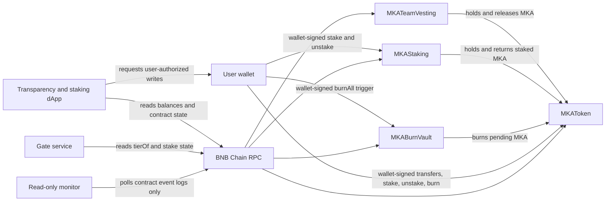

# Architecture

The arrows to the token describe token custody/transfers; the contracts do not call each other except for those ERC-20 operations. The gate and dApp are off-chain clients. The monitor uses an RPC provider with no signer and does not submit transactions.

## Main Flows

1. **Token transfer or burn:** an MKA holder transfers tokens or calls the inherited ERC-20 burn methods. Supply can decrease through burns and cannot increase after construction.
2. **Vesting:** the beneficiary's vesting wallet holds transferred MKA. After the one-year cliff, anyone may trigger release of the amount then vested to the fixed beneficiary; releases continue linearly through year three.
3. **Staking:** a wallet approves and stakes MKA. The contract updates its balance and seven-day lock, then pulls tokens. After the latest stake's lock expires, the same wallet can unstake no more than its recorded balance. `tierOf` derives the current access tier from its stake.
4. **Gate access:** the client obtains a server challenge and signs it with its wallet. The gate validates the challenge and reads the wallet's tier from staking before issuing application access information.
5. **dApp interaction:** the dApp reads token, staking, vesting, and vault state. Any write is requested from the user's wallet and requires the user's transaction signature.
6. **Monitoring:** the separate process polls Transfer, Burned, Staked, Unstaked, and vesting release logs and emits formatted alerts. Its JSON checkpoint is local operational state, not on-chain state.