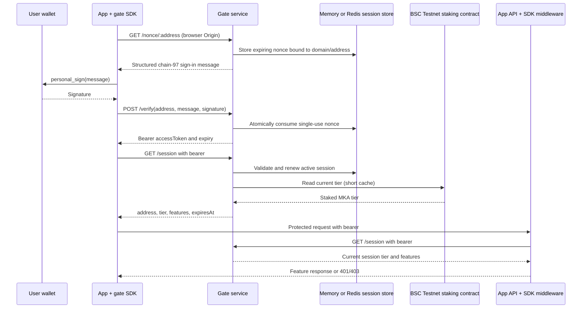

# MKA Gate Integration

**Phase 2 (deferred):** token-gated access and this gate integration are planned, subject to independent audit and remediation. They are not available at the initial core launch. See [launch phases](launch-phases.md) for entry criteria.

The gate authorizes app features from MKA staking state on BSC Testnet (chain ID 97). Wallet signatures establish control of an address; the Gate reads the address's current tier from the staking contract. The client SDK can display tiers and locked UI, but **every protected API route must enforce its feature on the server**.

## Architecture



## Sign-In

1. The client requests `GET /nonce/:address`. The browser's `Origin` must match an entry in `GATE_ALLOWED_DOMAINS`.
2. The Gate returns a single-use nonce and a human-readable message. The wallet signs the exact message using EIP-191 `personal_sign`.
3. The client submits the address, exact message, and signature to `POST /verify`. The Gate checks every field, recovers the signer, and atomically consumes the nonce before issuing a bearer token.
4. The client requests `GET /session`. The Gate validates the bearer, reads the on-chain tier, and returns `{ address, tier, features, expiresAt }`. Successful session reads renew the sliding session lifetime.

The signed message format is:

```text
MK Alpha Gate Sign-In
Domain: app.example
Address: 0x...
Chain ID: 97
Nonce: <single-use nonce>
Issued At: <ISO-8601 timestamp>
Expiration Time: <ISO-8601 timestamp>
```

The domain is the app host (including a non-default port, without scheme/path). The allowed-domain list is checked both when creating a nonce and when validating the signed message. Nonces expire after five minutes; sessions expire after 30 minutes without refresh. Tier reads are cached for 30 seconds by default.

## SDK Setup

The workspace package builds ESM and CommonJS entries. Its core client has no React dependency; React is an optional peer exposed separately. From the repository root:

```sh
npm ci
npm run build:gate-sdk
```

Client example:

```ts
import { createGateClient } from "@mka/gate-sdk";

const gate = createGateClient({
  gateUrl: "https://gate.example",
  domain: window.location.host,
  chainId: 97,
});

const session = await gate.connectAndSignIn(window.ethereum);
if (gate.hasFeature("basic-scanner")) {
  // Display unlocked UI only; the API must still enforce this feature.
}
```

React bindings are imported from `@mka/gate-sdk/react`: `GateProvider`, `useGate()`, and `<Gated feature="basic-scanner" fallback={...}>`.

## Add Server-Side Gating

Express middleware is imported from `@mka/gate-sdk/server`:

```ts
import { requireFeature, requireTier } from "@mka/gate-sdk/server";

app.get("/api/scanner/basic", requireFeature("basic-scanner"), handler);
app.get("/api/signals/premium", requireTier(3), handler);
```

The middleware sends the request's bearer token to the Gate's `/session` endpoint, uses a short local cache, and attaches `req.mka = { address, tier, features }`. It returns JSON 401 for absent/invalid sessions, 403 for insufficient access, and 503 if the Gate cannot validate the session. Do not implement protected data routes without this server-side check.

Plain-fetch integration without the SDK (the bearer stays in a local variable and is never logged or persisted):

```ts
const GATE_URL = "[GATE_URL]";
const provider = new BrowserProvider(window.ethereum);
const signer = await provider.getSigner();
const address = await signer.getAddress();

const nonceResponse = await fetch(`${GATE_URL}/nonce/${address}`);
const { message } = await nonceResponse.json();
const signature = await signer.signMessage(message);
const verifiedResponse = await fetch(`${GATE_URL}/verify`, {
  method: "POST",
  headers: { "content-type": "application/json" },
  body: JSON.stringify({ address, message, signature }),
});
const { accessToken } = await verifiedResponse.json();

const response = await fetch("/api/scanner/basic", {
  headers: { authorization: `Bearer ${accessToken}` },
});
if (response.status === 401) throw new Error("Connect your wallet");
if (response.status === 403) throw new Error("This feature is locked for your tier");
const appData = await response.json();
```

For SDK-backed app requests, `gate.authenticatedFetch()` attaches the bearer in memory and restricts requests to the current app origin. In either integration, the server middleware must validate the bearer and feature; never treat the client flow or CORS as authorization.

## Tier Mapping

Feature identifiers come from `gate/config.ts`; the Gate returns this mapping from its on-chain tier read:

| Staked tier | Feature identifiers |
| ---: | --- |
| 0 | None |
| 1 | `basic-scanner` |
| 2 | `basic-scanner`, `advanced-indicators` |
| 3 | Tier 2 features, `premium-signals` |

Only the contract's current staked MKA tier determines access. There are no payments or rewards in this flow.

## Deployment and Security Checklist

- Set `STAKING_ADDRESS` to the verified BSC Testnet staking contract and confirm the RPC reports chain ID 97.
- Set `GATE_ALLOWED_DOMAINS` to comma-separated app hosts/origins, including only exact approved domains. Keep `GATE_CORS_ORIGIN` aligned for older clients; CORS is not authorization.
- Use HTTPS for Gate, app, and API traffic outside local development. Do not send bearer tokens over plain HTTP on public networks.
- Memory storage is the default and is per process. Set `REDIS_URL` to select the optional ioredis-backed shared store for multiple Gate instances. Use a private, access-controlled Redis endpoint and TLS where available.
- Configure `GATE_TIER_CACHE_MS` (default 30000 ms), SDK/middleware local cache, and 60-request-per-IP-per-minute rate limits with expected load in mind. Load-test before production; multiple caches can briefly retain an earlier tier.
- Session lifetime is 30 minutes and refresh is sliding. Redis shares nonce/session state, while the tier cache remains per Gate instance.
- Never trust `<Gated>` or `hasFeature` as authorization. Apply `requireFeature`/`requireTier` to every protected API route and fail closed if Gate validation is unavailable.
- Do not log bearer tokens, signatures, nonce payloads, or wallet-private data. The SDK stores the access token in memory by default; optional `sessionStorage` is tab-scoped and can be disabled.
- Keep wallet private keys and seed phrases out of the app, Gate, examples, and environment templates. This flow uses an injected wallet signature and does not submit a transaction.